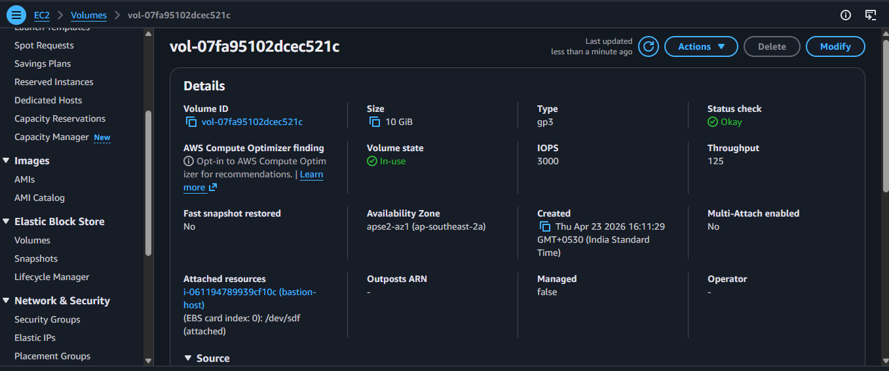
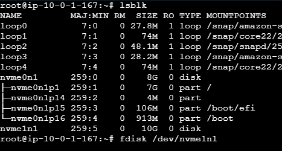
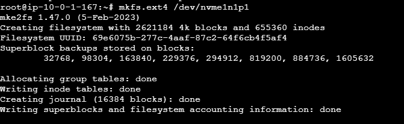
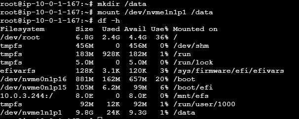
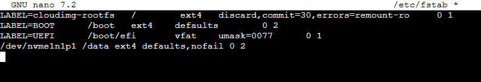
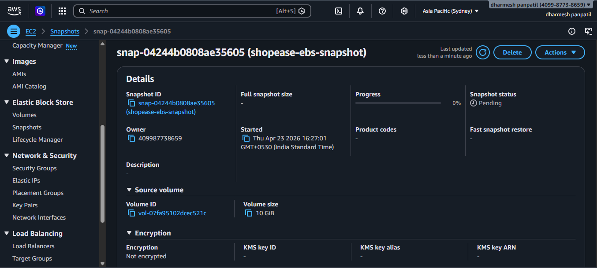
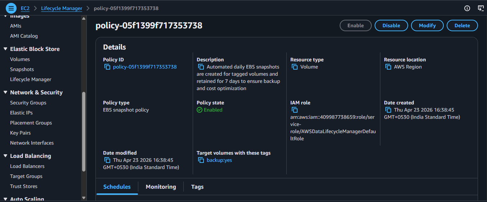

# 💽 AWS EBS Setup – ShopEase Project (Task 7)

## 📌 Overview
This task demonstrates:
- Create & attach EBS
- Format & mount
- Persistent storage
- Snapshot & lifecycle

---

## 📦 1. EBS Volume Created


---

## 🔗 2. Attach Volume to EC2


---

## 🔍 3. Verify Disk
```bash
lsblk
```

---

## 🧱 4. Format Volume
```bash
sudo mkfs.ext4 /dev/nvme1n1p1
```


---

## 📁 5. Mount Volume
```bash
sudo mkdir /data
sudo mount /dev/nvme1n1p1 /data
df -h
```


---

## 🔄 6. Permanent Mount
```bash
sudo nano /etc/fstab
```
Add:
```bash
/dev/nvme1n1p1 /data ext4 defaults,nofail 0 2
```


---

## 📸 7. Snapshot


---

## 🔁 8. Lifecycle Policy


---

## ✅ Outcome
✔ Volume created  
✔ Mounted  
✔ Persistent  
✔ Snapshot & lifecycle enabled  
