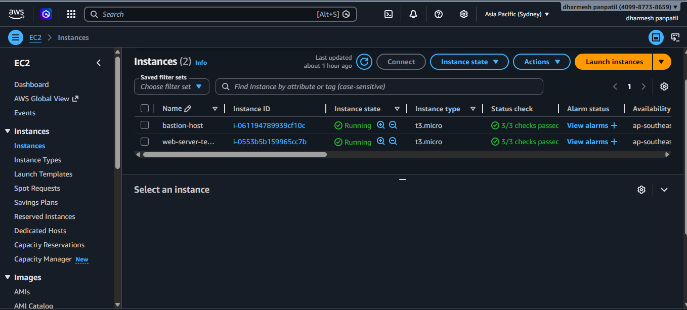

# ⚙️ AWS EC2 & Auto Scaling Setup – ShopEase Project (Task 4)

## 📌 Overview
This task covers EC2 infrastructure setup including:

- AMI creation
- EC2 instances (web + bastion)
- Launch Template
- Target Group
- Application Load Balancer (ALB)
- Auto Scaling Group (ASG)
- Scaling policies

---

## 🎯 Objectives

- Launch EC2 instances
- Create custom AMI
- Configure Load Balancer
- Setup Auto Scaling
- Ensure high availability

---

# 🖥️ 1. EC2 Instances

### ✔ Instances Created:
- Bastion Host
- Web Server

📸 Screenshot:

---

# 📀 2. Custom AMI

### ✔ AMI Created:
- Name: shopease-ami
- Platform: Linux
- Architecture: x86_64

📸 Screenshot:

---

# 📦 3. Launch Template

### ✔ Template Details:
- Name: shopease-template
- Instance type: t3.micro
- AMI: Custom AMI

📸 Screenshot:

---

# 🎯 4. Target Group

### ✔ Configuration:
- Protocol: HTTP
- Port: 80
- Target type: Instance

📸 Screenshot:

---

# 🌐 5. Application Load Balancer (ALB)

### ✔ Details:
- Type: Application Load Balancer
- Scheme: Internet-facing
- Availability Zones: Multi-AZ

📸 Screenshot:

---

# 📈 6. Auto Scaling Group (ASG)

### ✔ Scaling Policies:

#### 🔼 Scale-Out Policy
- Trigger: CPU ≥ 60%
- Action: Add 1 instance

#### 🔽 Scale-In Policy
- Trigger: CPU ≤ 30%
- Action: Remove 1 instance

📸 Screenshot:

---

# 🎯 Outcome

- EC2 instances running successfully  
- Load Balancer distributing traffic  
- Auto Scaling ensures high availability  
- Infrastructure is scalable and fault tolerant  
