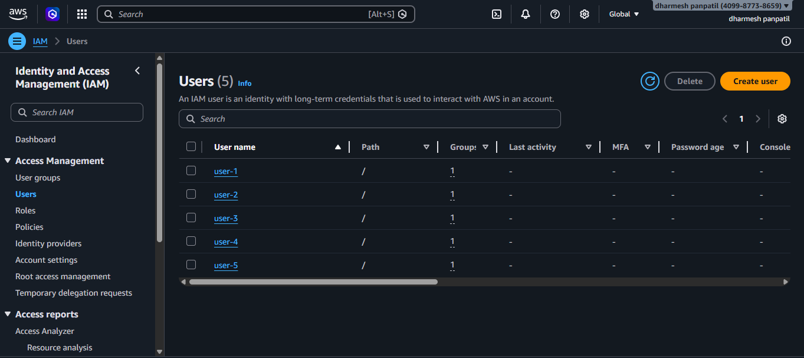
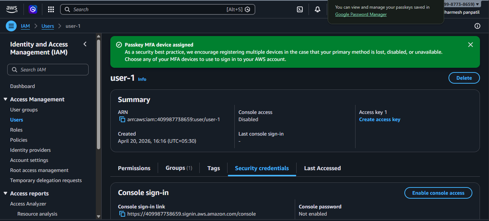
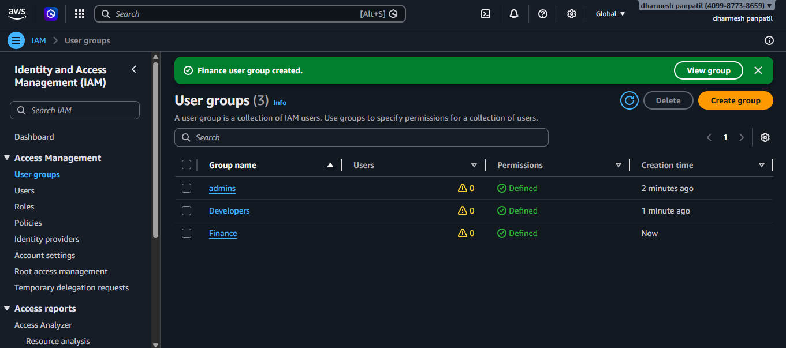
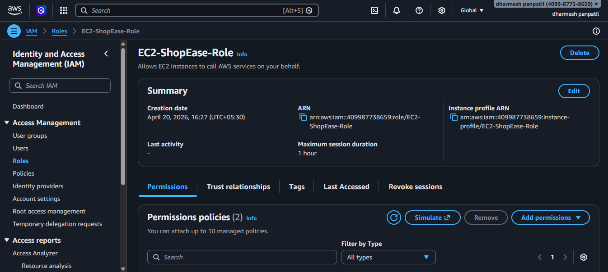
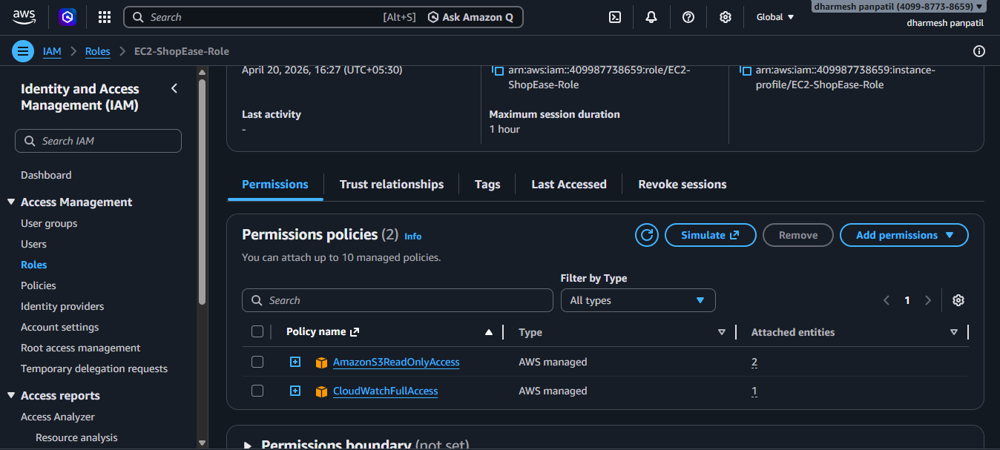

# 🔐 AWS IAM Setup – ShopEase Project (Task 2)

## 📌 Overview
This task focuses on implementing **AWS Identity and Access Management (IAM)** to securely control access to AWS resources.

We used:
- IAM Users
- IAM Groups
- IAM Roles
- Custom Policies
- Multi-Factor Authentication (MFA)

---

## 🎯 Objectives

- Create IAM users
- Organize users into groups
- Apply permissions using policies
- Enable MFA for security
- Create role for EC2
- Follow least privilege principle

---

# 🧑‍💻 1. IAM Users

Created multiple IAM users instead of using root account.

### ✔ Users Created:
- user-1
- user-2
- user-3
- user-4
- user-5

📸 Screenshot:


---

# 🔑 2. Multi-Factor Authentication (MFA)

Enabled MFA for extra login security.

📸 Screenshot:


---

# 👥 3. IAM Groups

Groups help manage permissions easily.

📸 Screenshot:


---

# 📜 4. Custom IAM Policy

```json
{
  "Version": "2012-10-17",
  "Statement": [
    {
      "Effect": "Deny",
      "Action": "rds:DeleteDBInstance",
      "Resource": "*"
    }
  ]
}
```

---

# 🔗 5. IAM Role for EC2

📸 Screenshot:


---

# ⚙️ 6. Role Permissions

📸 Screenshot:


---

# 🏁 Conclusion

IAM ensures secure authentication and controlled access.
