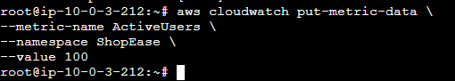
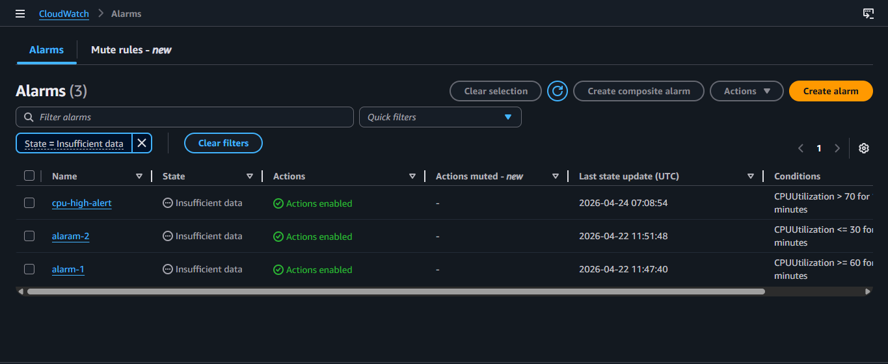
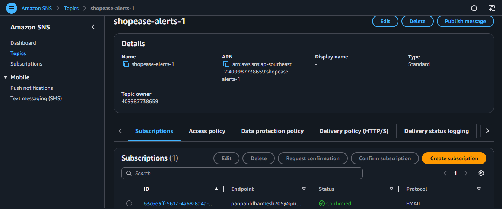
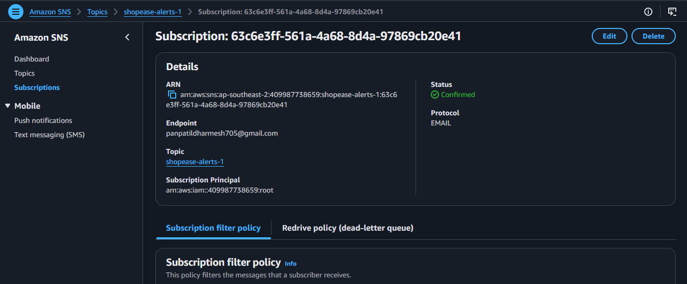
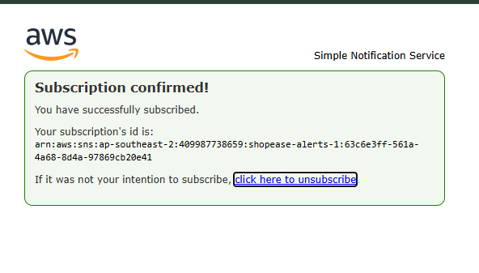
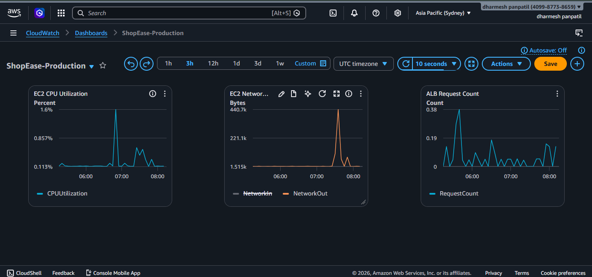
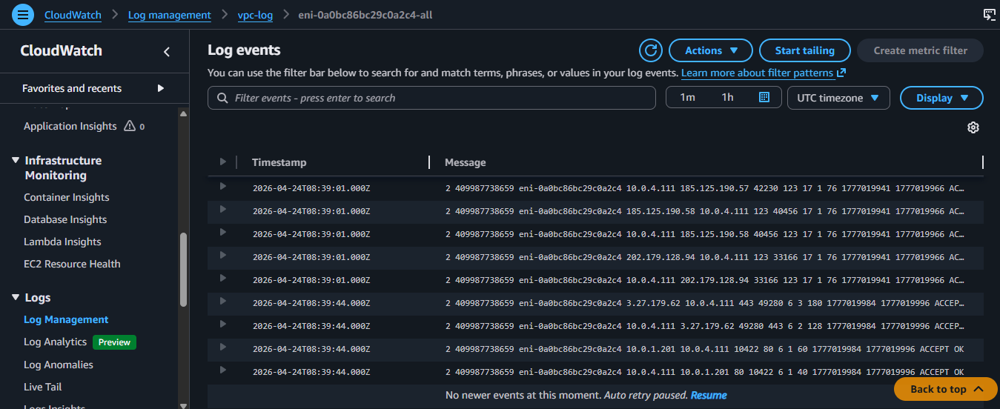

# 📊 AWS Monitoring & Alerts – ShopEase Project (Task 8)

## 📌 Overview
This task covers:
- Custom metrics (CloudWatch)
- Alarms
- SNS notifications
- Dashboard
- VPC Flow Logs

---

## 🧮 1. Custom Metric (CloudWatch CLI)
```bash
aws cloudwatch put-metric-data --metric-name ActiveUsers --namespace ShopEase --value 100
```


---

## 🚨 2. CloudWatch Alarms


---

## 📢 3. SNS Topic Created


---

## 📩 4. Subscription Created


---

## ✅ 5. Subscription Confirmed


---

## 📊 6. CloudWatch Dashboard


---

## 📜 7. VPC Flow Logs


---

## ✅ Outcome
✔ Custom metric created  
✔ Alarm configured  
✔ SNS notifications working  
✔ Dashboard created  
✔ Logs monitoring enabled  
