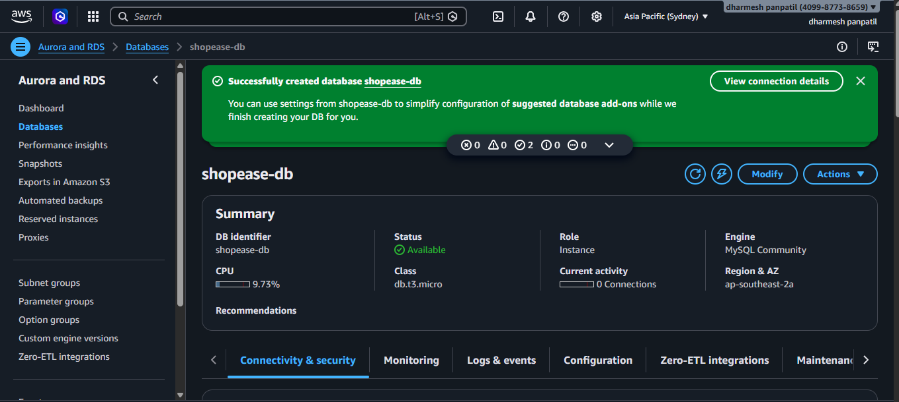
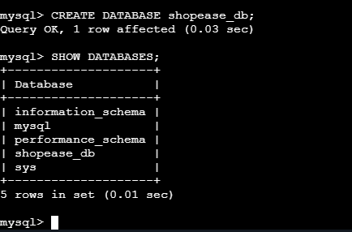
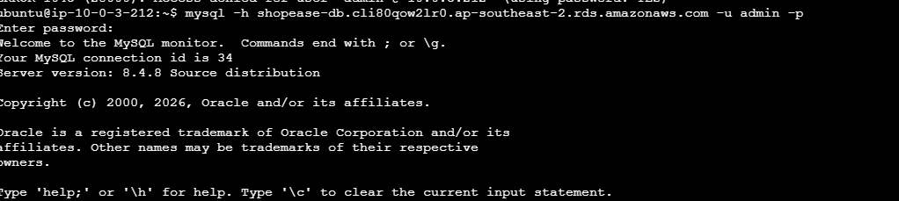
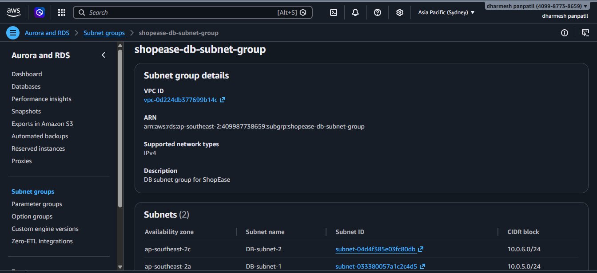
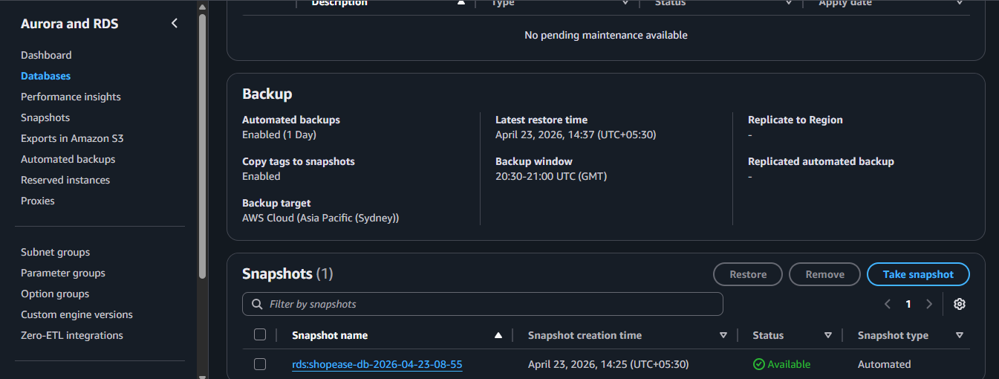

# 🗄️ AWS RDS Setup – ShopEase Project (Task 5)

## 📌 Overview
This task covers Amazon RDS (Relational Database Service) setup:

- MySQL database creation
- DB subnet group configuration
- EC2 to RDS connectivity
- Backup & snapshots

---

## 🎯 Objectives

- Create RDS instance
- Configure DB subnet group
- Connect EC2 to RDS
- Enable backups
- Verify database operations

---

# 🛢️ 1. RDS Database Created

### ✔ Details:
- DB Name: shopease-db
- Engine: MySQL
- Instance type: db.t3.micro
- Status: Available

📸 Screenshot:


---

# 📂 2. Database Creation (MySQL)

### ✔ Commands Used:

```sql
CREATE DATABASE shopease_db;
SHOW DATABASES;
```

📸 Screenshot:



---

# 🔗 3. Connect EC2 to RDS

### ✔ Connection Command:

```bash
mysql -h <rds-endpoint> -u admin -p
```

📸 Screenshot:


---

# 🌐 4. DB Subnet Group

### ✔ Details:
- Name: shopease-db-subnet-group
- Subnets: Private subnets

📸 Screenshot:


---

# 💾 5. Backup & Snapshots

### ✔ Features:
- Automated backups enabled
- Snapshot created

📸 Screenshot:


---

# 🎯 Outcome

- RDS database successfully created  
- EC2 connected to database  
- Backup and snapshots configured  
- Database ready for production use  
